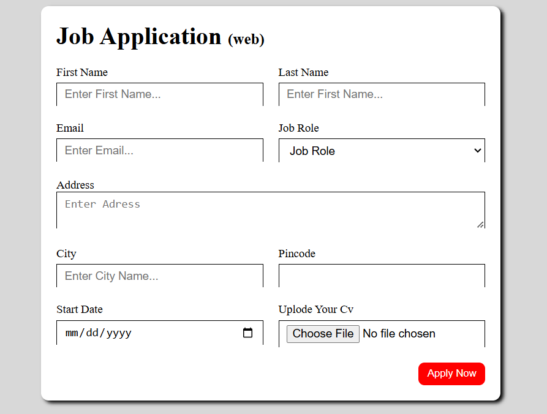

# 🚀 Job Application Form  

A modern and responsive **Job Application Form** crafted with **HTML & CSS**, designed to streamline the application process. Job seekers can effortlessly enter their details, choose a job role, and upload their CV with ease. 

---

## 📌 Features  

✅ **Fully Responsive Design**  
✅ **User-friendly Interface**  
✅ **Input fields** for First Name, Last Name, Email, Address, City, and Pincode  
✅ **Dropdown menu** to select Job Role  
✅ **File Upload** option for CV submission  
✅ **CSS Grid Layout** for structured alignment  
✅ **Smooth hover effects** for an interactive experience  

---

## 🛠️ Technologies Used  

🔹 **HTML5** - Structuring the form  
🔹 **CSS3** - Styling and layout  
🔹 **Responsive Design** - Ensuring mobile-friendliness  

---

## 📷 Preview  
🖼️  


---
## 🚀 Getting Started
Follow these steps to get the project up and running:

1️⃣ **Clone this repository**  
   ```sh
   git clone https://github.com/absattarghoto/job_application_form.git